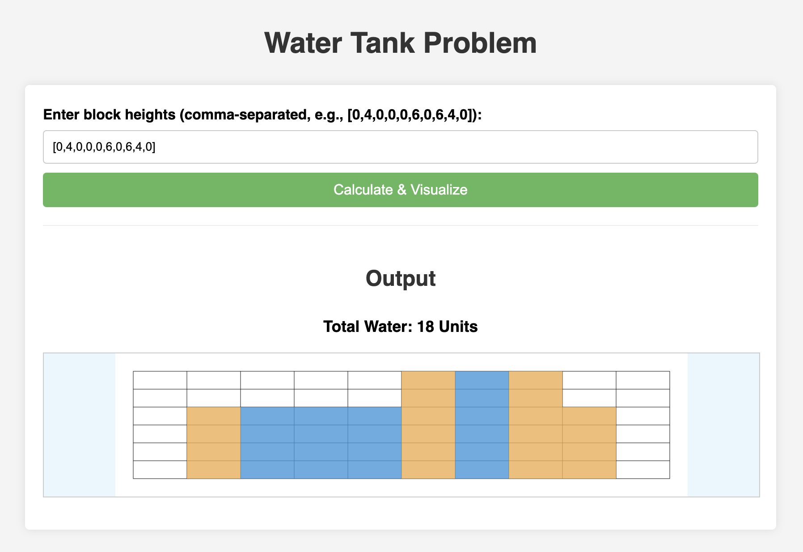

# Water Tank Problem Visualizer

This project calculates the amount of water that can be trapped between blocks of varying heights and provides an SVG visualization of the blocks and the trapped water.

## Features

- Calculates the total units of trapped water using an efficient algorithm.
- Generates a dynamic SVG visualization showing:
  - The blocks
  - The trapped water
  - A grid for reference
- Simple web interface to input block heights and view results.

**Example:**

Input: `[0,4,0,0,0,6,0,6,4,0]`
Output (Calculation): `18 Units`
Output (Visualization): An SVG image showing the blocks and the blue water trapped between them.

## Screenshot

Example visualization for input [0,4,0,0,0,6,0,6,4,0] showing 18 units of trapped water.



## Getting Started

1.  **Clone the repository:**
    ```bash
    https://github.com/nithya-kala/water-tank.git
    cd water-tank
    ```
2.  **Open the application:**
    Simply open the `index.html` file in your preferred web browser.

## Usage

1.  The application loads with a default input array `[0,4,0,0,0,6,0,6,4,0]`.
2.  Enter your desired block heights in the input field. You can use:
    - A JSON-style array (e.g., `[0, 1, 0, 2, 1, 0, 1, 3, 2, 1, 2, 1]`)
3.  Click the "Calculate & Visualize" button.
4.  The total calculated units of trapped water will be displayed below the button.
5.  An SVG image representing the blocks and trapped water will be generated in the container below the result text.

## Technology Stack

- **HTML5:** Structure of the web page.
- **CSS3:** Styling the page elements and SVG components (blocks, water, grid).
- **Vanilla JavaScript (ES6+):**
  - DOM manipulation.
  - Input parsing and validation.
  - Trapped water calculation logic.
  - Dynamic SVG generation.
- **SVG (Scalable Vector Graphics):** Used for rendering the visualization.
